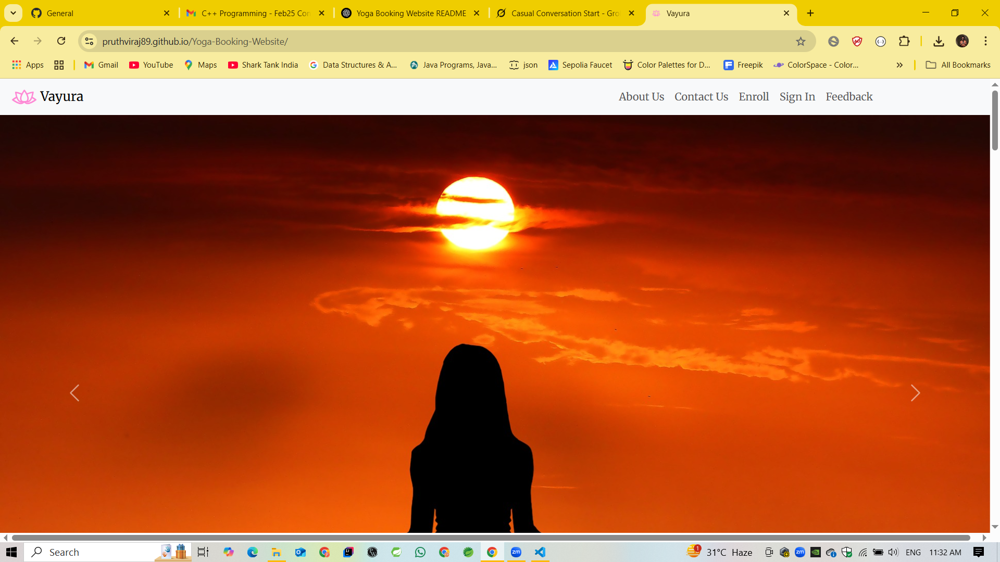
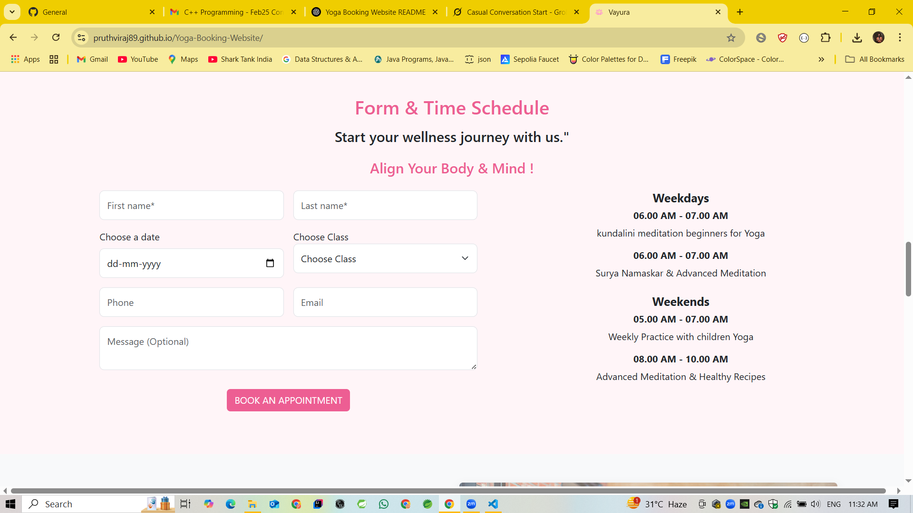
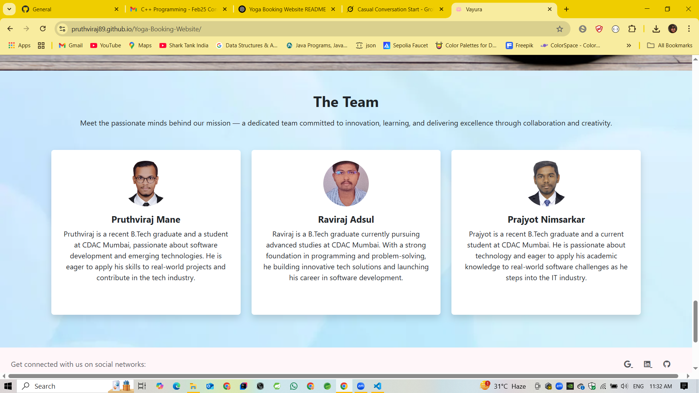

# Vayura Yoga Booking Website

 [](https://opensource.org/licenses/MIT)

Welcome to **Vayura**, a web application for a yoga center offering class bookings, trainer profiles, and wellness resources. This project provides a user-friendly platform for individuals to enroll in yoga classes, explore schedules, meet professional trainers, and connect with the Vayura community.


### Home


## Table of Contents
- [Features](#features)
- [Technologies Used](#technologies-used)
- [Installation](#installation)
- [Usage](#usage)
- [Project Structure](#project-structure)
- [Contributing](#contributing)
- [Contact](#contact)

## Features
- **Class Booking System**: Users can book yoga classes (e.g., Hatha Yoga, Vinyasa Flow, Restorative Yoga) by selecting dates and class types.
- **Trainer Profiles**: Showcase certified trainers with details on their experience and expertise.
- **Class Schedules**: View weekday and weekend schedules for various yoga sessions, including Kundalini Meditation and Surya Namaskar.
- **User Authentication**: Sign-up and login functionality for personalized user experiences.
- **Feedback Form**: Collect user feedback with a rating system and suggestions.
- **Responsive Design**: Mobile-friendly interface for seamless access across devices.
- **Contact Information**: Connect with the yoga center via email, phone, or physical address.
- **Social Media Integration**: Links to social media platforms for community engagement.

### Home


## Technologies Used
- **Frontend**:
  - HTML5
  - CSS3 (assumed for styling, based on typical web project structure)
  - JavaScript (assumed for interactivity, e.g., form validation, carousel)
- **Backend** (assumed, as not specified in `index.html`):
  - Node.js/Express.js or similar for handling bookings and authentication
  - MongoDB/MySQL for storing user and booking data
- **Version Control**: Git and GitHub
- **Deployment** (optional): Vercel, Netlify, or Heroku (recommended for hosting)


### Form



## Installation
Follow these steps to set up the project locally:

1. **Clone the Repository**:
   ```bash
   git clone https://github.com/Pruthviraj89/Yoga-Booking-Website.git
   cd Yoga-Booking-Website
   ```

2. **Install Dependencies** (if a backend or node_modules is included):
   ```bash
   npm install
   ```

3. **Set Up Environment Variables** (if applicable):
   - Create a `.env` file in the root directory.
   - Add necessary configurations (e.g., database URI, API keys):
     ```env
     DATABASE_URL=your_database_url
     PORT=3000
     ```

4. **Run the Application**:
   - For a static site, open `index.html` in a browser:
     ```bash
     open index.html
     ```
   - For a full-stack app, start the server:
     ```bash
     npm start
     ```
   - Access the site at `http://localhost:3000` (or the specified port).

5. **Database Setup** (if applicable):
   - Ensure MongoDB/MySQL is installed and running.
   - Import any provided database schema or seed data.

## Usage
- **Browse Classes**: Navigate to the "Form & Time Schedule" section to view available classes and book appointments.
- **Sign Up/Login**: Create an account or log in to access personalized features.
- **Explore Trainers**: Learn about certified trainers like Riya Sharma and Vikram Singh.
- **Provide Feedback**: Share your experience using the feedback form.
- **Contact Us**: Reach out via the contact form or visit the CDAC Yoga Center in Navi Mumbai.

For administrators:
- Manage class schedules and bookings (backend functionality assumed).
- Review user feedback and respond to inquiries.

## Project Structure
```
Yoga-Booking-Website/
├── index.html          # Main HTML file for the website
├── css/                # (Assumed) Stylesheets
├── js/                 # (Assumed) JavaScript for interactivity
├── assets/             # (Assumed) Images, fonts, and other static files
├── server/             # (Assumed) Backend code (e.g., Node.js)
├── .env                # Environment variables
├── package.json        # Node.js dependencies (if applicable)
└── README.md           # Project documentation
```

### Teammates


## Contributing
Contributions are welcome! To contribute:
1. Fork the repository.
2. Create a new branch:
   ```bash
   git checkout -b feature/your-feature-name
   ```
3. Make your changes and commit:
   ```bash
   git commit -m "Add your feature description"
   ```
4. Push to your branch:
   ```bash
   git push origin feature/your-feature-name
   ```
5. Open a pull request on GitHub.

Please follow the [Code of Conduct](CODE_OF_CONDUCT.md) and ensure your code adheres to the project's coding standards.

